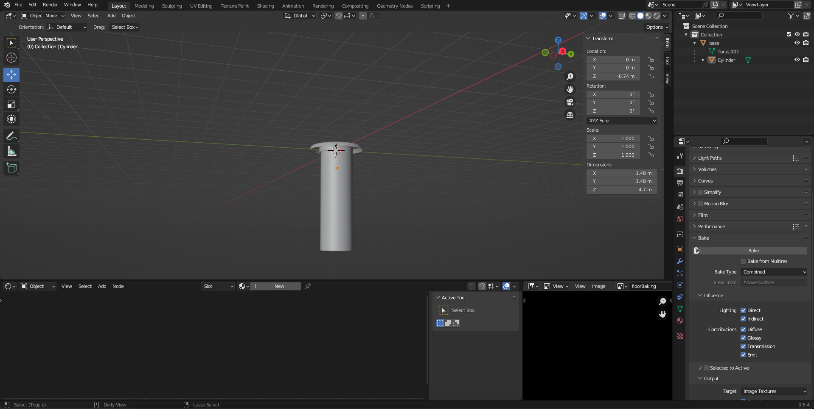
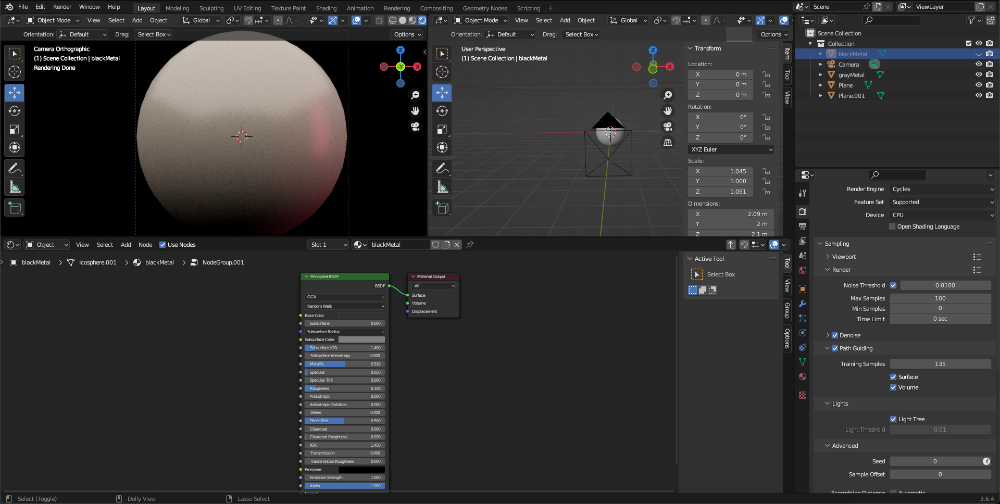
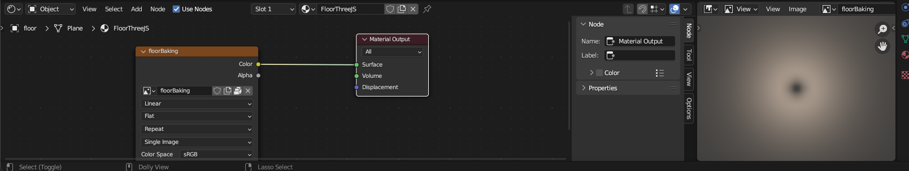
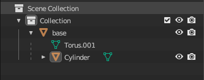

# Sound Pillar Model 🔉
Animated centered sphere with animated custom fragment and vertex shaders, with custom
cylinders spiraling to the beat of my favorite video game song known as "This Game Remix" by
[dj-Jo](https://www.newgrounds.com/audio/listen/584253) when the user clicks the "Play" button.

## My Process
The later sections will talk a little bit of my process in this five-day long project, as I had 
a lot of debugging issues. However, I enjoyed every step of the process and inspired me to build more
custom 3D objects and real time animate with the [three.js library](https://threejs.org). I will not delve too much 
into detail as a lot went into this project, but simply touch up on most of the process.

### Getting Started
If you'd like to add onto this project (also how I started this project), the below sections are laid out from the project 
setup all the way down to running/building. I used the following frameworks and libraries for my project.

<div style="display: flex;">
    <ul style="list-style-type: none; width:33.333333%; float:left;">
        <li style="flex: 1 0 25%;">
            
            <p style="text-align: left;">Vue</p>
        </li>
        <li >
            
            <p style="text-align: left;">Three.js</p>
        </li>
        <li >
            
            <p style="text-align: left;">JavaScript</p>
        </li>
    </ul>
</div>

#### Project setup
```
git clone https://github.com/MariusBallot/04-2021-Vue-Three-Starter.git
npm i
```

#### Compiles and hot-reloads for development
```
npm start
```

#### Compiles and minifies for production
```
npm run build
```


### Blender Process
Using Blender, an open software to create 3D models, allowed me to create 90% of my assets,
which saved on cost efficiency to render out the pillars and sphere to a web application.
It also allowed me to create everything to my liking, including
creating my own textures the user sees in the browser and gives control to the subdivision count so
the web application will not crash on most browsers.
I created one of each of these models below, be warned
every link will jump you to the appropriate local project resource:
* [Custom Pillar GLB Model](public/assets/models/pillar.glb)
  * [One Ring Base](images/pillarBlenderImage.png)
  * [One Cylinder Base](images/pillarBlenderImage.png)
  * 
* [Custom Particle GLB Effect](public/assets/models/spectrum.glb)
  * This is done by integrating [custom shaders](src/shaders) using .frag and .vert in order to create a moving particle effect onto the custom [spectrum.glb](public/assets/models/spectrum.glb) asset.
  * Done through the use of mixing and blending different 3D vectors then mapped onto the GLB model
    * Animations were done using Math.Sin() to get the right effect.
* [Custom MatCapTextures](public/assets/textures)
  * Building custom textures allowed me to have the precise colors to my standards.
  * 
* [Custom Floor GLB Model](public/assets/models/floor.glb)
  * Using custom-rendered baked model onto the floor itself saved 40% of memory cost to a web browser
  * 
    * Better memory management than using a Three.js lighting onto my sphere model. 

### Integrating Custom Blender Models to Three.js

### Sphere and Pillars Class
I needed one of each model to be statically imported as a .glb file in order to animate it via programming logic
with the Three.js library, which was my goal initially. In order to model each cylinder onto the sphere, we needed
to break down the vertices of each sphere subdivision into a nice matrix (x, y, z) pair. Looping through each subdivision 
on the sphere to only cut down to one-point vertex allowed in a reduction of pillar placement, so each one is placed
in the center of each subdivision. A lot of wording there, but in my [SpherePillarsClass.js](src/classes/SpherePillarsClass.js)
I found out the necessary looping added each pillar placement in the center of each sphere subdivision.
Next, I animated each Pillar along its origin of (0, 0, 0) which I meticulously added to the world origin
in blender, so I may animate the child of the children (in this case it's the cylinder) because Three.js 
takes in a .glb file to access all children in the model. This way I target the cylinder only to move across its 
respective y origin in [SpherePillarsClass.js](src/classes/SpherePillarsClass.js) then adding sin frequencies
to the standard animation the user sees to be across it's x origin pillar group in Three.js.
Here is a visualization in blender which summarizes the above pretty well: 

<br>
As you see above the cylinder is targeted model base to the Cylinder (0, 0, 0) position.
Finally, I added the [SoundReactor.js](src/classes/SoundReactor.js) to my project to generate a different
animation through the sound frequency in my [song choice](public/assets/sounds/This-Game-Remix.mp3). Here is
the code snippet responsible for all I have said in this section.
```javascript
        //  If the sound is playing, update the position of the pillars to be animated to the song else default animation
        if(sound.playFlag) {
            //  Initialize the pillars position onto the icoSphere
            let i = 0
            while(i < pillars.children.length) {
                let frequency = sound.fdata[i] / 255
                pillars.children[i].children[0].position.y = frequency * 3.5
                i++
            }
        } else {
            //  Initialize the pillars position onto the icoSphere
            let i = 0

            while(i < pillars.children.length) {
                pillars.children[i].children[0].position.y = (Math.sin(Date.now() * 0.01 * customWaveSpeed + pillars.children[i].position.x) + 1) * 1.5
                i++
            }
        }
```
Once again, the frequency is being multiplied by a scalar of 3.5 in order for each cylinder not to fly off the
sphere completely, but the frequency is divided first by 255 as sound frequencies are very intense.
Everything else is mostly working around this snippet, including adding it to Three.js and rendering it
to the DOM via the Vue library.


### Other Model Imports
Other model imports were tweaked around a bit such as the floor obtaining a fog visualizer so the background
blends in with the entire scene, and the particle effect is done through its [spectrum.frag](src/shaders/spectrum.frag)
custom shader.
I did use sine to transform the particles and grabbed its reference to alter it via the
GUI component (more on that in the later section). Every other model was imported statically and placed
to the scene appropriately, and the camera controls were tweaked accordingly so the user doesn't scroll
a certain negative y-position. To end it off, each model was extremely fun to create and import using
Three.js and I'd recommend to take a look at the source code to learn more about how each model was placed
and animated which is found in my [classes directory](src/classes).


### GUI Implementation
```javascript
//  FROM SpherePillarsClass.js
import MyGUI from "@/utils/MyGUI";
class SpherePillarsClass {
  constructor() {
    // ... rest of code...
    //  GUI Params initialization below
    this.params = {
      waveSpeed: 1,
      subDivisions: 3,
      pillarsSize: 0.2,
    }
  }

  // ... rest of code...

  init() {
    const sphereFolder = MyGUI.addFolder('Sphere Pillars');
    sphereFolder.open();
    sphereFolder.add(this.params, 'waveSpeed', 0.001, 3).name('Wave Speed');
    sphereFolder.add(this.params,'subDivisions', 1, 5).step(1).name('IcoSphere Subdivisions').onChange(this.computePositions);
    sphereFolder.add(this.params, 'pillarsSize', 0.01, 0.60).name('Pillar Size').onChange(this.computePositions);
  };
}
```
As seen from the code snippet above, each GUI component is used by the default Three.js GUI component.
Adding a folder to each of the components found in my scene, which may be animated with different variables
through the use of sliders, allowed the organization to construct a new GUI component thus allowing the user to play
around with my "Sound Pillars" model.
Each class that is animated has a constructor to take in their respective parameters which is updated via
the GUI component, and their respective bound update function calls, thus re-rendering the scene to either
add or remove a model onto the scene.
From there I added .name() labels to each of the components and .onChange() will re-render the corresponding
functions to remove/add more onto the 3D model scene.
Finally, every other component will be the same but with different respective variables such as the Camera Controls 
to the spectrum wave particle color/speed/border-width. 
Play along with the GUI and see what you can create!


## Final Thoughts
I understand I didn't delve into each concept of the project, but I urge you to check out the source code as I have
left comments around to each class, but I did cover most of my big concepts that went into this project.
I loved creating this project from the nostalgia of creating 3D blender models, as I actually wanted to become
a Graphic Designer through my [CATS PathWay Program](https://www.mhscats.com/) in high school where we created
a lot of 3D models in Cinema4D and Z-Brush. 
Final song credits to [djJo](https://dj-jo.newgrounds.com) for his song use in my project!
However,
my journey of math and coding ultimately led me to study computer science,
and this project was in that way delivering to people I can integrate the best of my two passions into one,
which is 3D-modeling and programming.
I bid you farewell if you have read this far,
please follow me on the following social media and let's connect about any solutions you need or just to chat!
* [My Linkedin](https://www.linkedin.com/in/jesusperezarias/)
* [My Twitter](https://twitter.com/jay_develops_)
* [My Instagram](https://www.instagram.com/jay.develops)
* [My Awwwards Profile](https://www.awwwards.com/jaydevelops/)